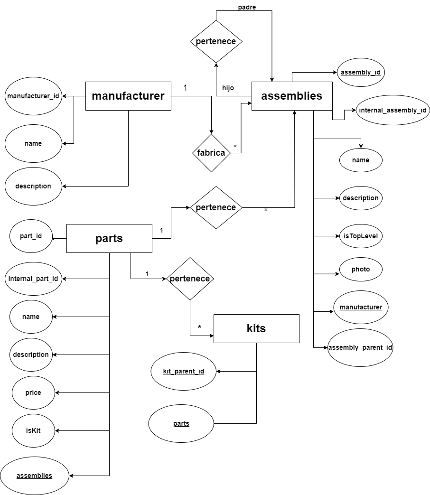
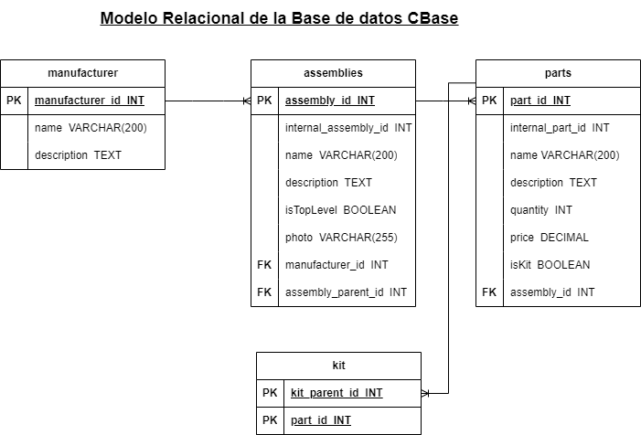

# Catalog base

## Listado de entidades

### manufacturer **(ED)**

- manufacturer_id **(PK)**
- name
- description

### assemblies **(ED)**

- assembly_id **(PK)**
- internal_assembly_id
- name
- description
- isTopLevel
- photo
- manufacturer_id **(FK)**
- assembly_parent_id **(FK)**

### parts **(ED)**

- part_id **(PK)**
- internal_part_id
- name
- description
- quantity
- price
- isKit
- assembly_id **(FK)**

### kits **(ED)**

- kit_parent_id **(PK)**
- part_id **(PK)**

## Relaciones

1. Un **manufacturer** _fabrica_ muchos **assemblies**. (_1 a \*_)
2. Un **assemblies** hijo _pertenece_ a un **assemblies** padre. (_1 a 1_)
3. Un **parts** _pertenece_ a muchos **assemblies**. (_1 a \*_)
4. Un **parts** _pertenece_ a muchos **kits**. (_1 a \*_)

## Diagramas

## Modelo Entidad - relación

## Modelo relacional de la Base de datos

## Reglas de Negocio

### manufacturer

1. Crear el registro de un manufacturer.
1. Leer todos los registros de la entidad manufacturer.
1. Actualizar los datos de un manufacturer.
1. Listar todos los manufacturer.

### assemblies

1. Crear el registro de un assembly
1. Leer el registro de un assembly dada una condicion en particular.
1. Leer todos los registros de la entidad assembly dada una condicion en particular.
1. Actualizar los datos de un assembly dada una condicion en particular.
1. Lista todos los assemblies dada una condicion en particular.
1. Eliminar los datos de un assembly dada una condicion en particular
1. Establecer un assembly como toplevel.
1. Vincular un registro de la entidad part con su assembly parent.
1. Desvincular un registro de la entidad part asociado a un assembly.
1. Asociar un dibujo con un assembly.
1. Sensibilidar secciones del dibujo con el listado de parts.

### parts

1. Crear el registro de una part.
1. Leer el registro de una part dada una condicion en particular.
1. Leer todos los registros de la entidad part dada una condicion en particular.
1. Actualizar los datos de una part dada una condicion en particular.
1. Listar todas las parts dada una condicion en particular.
1. Eliminar los datos de una part dada una condicion en particular.
1. Vincular un registro de la entidad part con sus assembly parent.
1. Desvincular una registro de la entidad part asociado a un assembly.
1. Establecer una part como kit.
1. Vincular un registro de la entidad part a un kit.
1. Desvincular un registro de la entidad part asociado a un kit.

### kits

1. Seleccionar un kit dada una condicion en particular.
1. Vincular un registro de la entidad part a un kit
1. Desvincular un registro de la entidad part asociado a un kit
